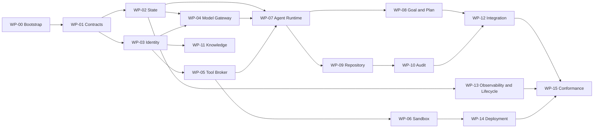

# AOR 实现计划与课程交付状态

> 基线：2026-08-14，源代码提交 `8cfbe44`
>
> 计划性质：基于不可变 Git 历史和 `work-packages/` 的 as-built 计划，加上尚未完成的课程收尾计划
>
> 状态标记：`DONE` 已有提交证据；`PENDING` 尚需执行；`DEVIATION` 无法通过事后补写还原的历史流程偏差

## 1. 计划原则

1. `SPEC.md` 是目标规范；本文件只描述执行顺序、依赖、文件、验证和当前状态。
2. 原始开发没有使用 Superpowers `writing-plans`，也没有先生成课程格式的 `PLAN.md`。实际计划载体是 `work-packages/wp-00` 至 `wp-15`，每包包含 `MODULE_SPEC.md`、`DESIGN.md`、`INTERFACES.md`、`THREAT_MODEL.md`、`TEST_PLAN.md`、`MIGRATION_PLAN.md`、`OPERATIONS.md` 和 `CHANGELOG.md`。
3. 下表是从这些文件和 Git 提交树重建的事实记录，不声称它在实现前以本文件形式存在。
4. 每个代码任务的失败测试和验证细节以对应 `TEST_PLAN.md` 与提交 diff 为准；课程文档任务使用结构检查而不是虚构单元测试。
5. 并行关系只表达依赖图。历史仓库只有一个 worktree 和 `master` 分支，因此不能把逻辑并行误写成已执行的 worktree/PR 证据。

## 2. 依赖图



WP-02/03、WP-04/05/11 以及 WP-13/14 在依赖满足后可逻辑并行；实际开发仍在同一工作树完成。

## 3. 已完成工作包

| Task | 目标 | 主要文件 | 预期失败测试 / 验证 | 依赖 | 状态与首个主体提交 |
|---|---|---|---|---|---|
| WP-00 | 建立可构建仓库、约束和工具入口 | `go.mod`、`Makefile`、目录骨架 | source-format、secret scan、仓库布局检查先失败后补齐 | 无 | DONE `cb80311` |
| WP-01 | AOP、CloudEvents、Schema 与错误合同 | `pkg/contracts/`、`api/`、`schemas/` | 未知必需扩展、UUIDv7、跨语言 Schema 夹具 | WP-00 | DONE `89d0a77` |
| WP-02 | 确定性状态机、事件、事务和幂等 | `internal/state/`、`internal/eventing/`、migrations | 非法迁移、重复命令、乱序/重放、租户投影 | WP-01 | DONE `d8e4997` |
| WP-03 | 身份、授权、Approval 与 Lease | `internal/authn/`、`internal/authz/`、`policies/` | 过期/伪造 Lease、跨租户、commit-time revalidation | WP-01 | DONE `e948a27` |
| WP-04 | 多供应商模型网关、预算和重放 | `internal/modelgateway/`、`internal/modelproviders/`、`model-adapters/` | 预算不足、重复请求、流式终态、供应商失败 | WP-02/03 | DONE `4c9fa9c` |
| WP-05 | Tool Broker 与 MCP 授权边界 | `internal/toolbroker/`、`tool-adapters/` | 未声明工具、参数错误、Lease 不匹配、重复调用 | WP-03 | DONE `53e6948` |
| WP-06 | 平台能力和隔离证明 | `internal/sandbox/`、`sandbox/` | mount/网络/平台能力不满足时 fail closed | WP-03/05 | DONE `8f345ff` |
| WP-07 | 自实现 Agent Runtime 和可注入模型循环 | `internal/agentruntime/` | 生命周期、Prompt 信任、tool loop、轮次上限 | WP-02/04/05 | DONE `f0d54b7` |
| WP-08 | Goal 协商、Plan DAG 和原子发布 | `internal/goalplan/`、`internal/orchestrator/` | 未批准 Goal、双角色记录混合、非法 DAG、非原子发布 | WP-07 | DONE `5bfd815` |
| WP-09 | 受路径所有权约束的 Git 工作区和 Submission | `internal/repository/` | 越权路径、脏工作树、过期 fence、重复提交 | WP-03/07 | DONE `97f7d2b` |
| WP-10 | 固定顺序验证、盲审和 Evidence Bundle | `internal/audit/`、`audit/` | Executor 自述污染、顺序漂移、证据签名/attempt 混淆 | WP-09 | DONE `e883094` |
| WP-11 | 不可变项目知识、继承和 Curator 写入 | `internal/knowledge/`、`knowledge/` | 跨项目读取、未批准写入、symlink、旧 revision | WP-03 | DONE `85226f4` |
| WP-12 | 集成审计和幂等 Merge Queue | `internal/integration/` | 路径/接口冲突、并发重复 merge、未审计候选 | WP-08/10 | DONE `d19df46` |
| WP-13 | 遥测、第三次失败与数据生命周期 | `internal/observability/`、`internal/lifecycle/` | 敏感正文、第三次失败漏采样、删除/保留冲突 | WP-02 | DONE `0c1bef7` |
| WP-14 | Compose、Helm、Windows 与部署门禁 | `deploy/`、`internal/deployment/` | 明文 Secret、宿主 socket、错误隔离等级、跨平台编译 | WP-06 | DONE `f73169f` |
| WP-15 | 可重复 conformance 与发布证据 | `internal/conformance/`、`conformance/` | planned requirement 冒充通过、证据哈希/签名不匹配 | WP-12/13/14 | DONE `363d0bd` |

## 4. 交付后演进任务

这些任务来自真实用户测试，不属于最初 16 个工作包，但改变了课程默认链路。

| Task | 目标和文件 | 验证 | 状态 / 代表提交 |
|---|---|---|---|
| EV-01 | 将 Goal、Plan、Execution、Audit 接入真实服务启动和持久工作流 | Compose 健康检查、项目状态投影、真实供应商调用 | DONE；相关提交分布于 `internal/servicebootstrap/` 与 2026-08-04 至 08-09 历史 |
| EV-02 | 增加 WebUI、项目活动流和模型供应商设置 | TypeScript build、HTTP/SSE 回归、真实连接测试 | DONE；代表提交 `73ed266`、`3b06255` |
| EV-03 | 支持受授权的工具链归档安装与恢复 | archive 安全夹具、隔离探测、队列恢复 | DONE；`17ce6cd` 至 `10624fa` |
| EV-04 | 长对话上下文压缩、窗口配置与容量边界 | mock gateway、manifest forgery、overhead 和超窗测试 | DONE `a816cd0`、`7d2c882`、`9cf01a4` |
| EV-05 | 单命令 TEST 部署与极简教程 | Compose config、所有 readiness endpoint | DONE `9a64c29`、`b15fc43` |
| EV-06 | Mock 环境、凭据清除、命令审核和 GitHub CI | 聚焦 Go/Web tests、`make verify`、容器 build | DONE `4167ec8`、`3a16877`、`d1378b9`、`8cfbe44` |

## 5. 课程文档收尾任务

以下任务按 2 至 5 分钟的可检查步骤拆分。课程文档主体提交为 `572eaa4`。

| Task | 目标 | 文件 | 实现要点 | 失败检查与验证 | 依赖 | 状态 |
|---|---|---|---|---|---|---|
| COURSE-DOC-01 | 保存原始课程要求和 brainstorming | 两份 `AI4SE_*.md`、`ChatGPT-Agent组织器设计可行性.json` | 原文跟踪，不改写对话 | `git ls-files` 缺少文件时失败；JSON 用 `jq empty` | 无 | DONE `572eaa4` |
| COURSE-DOC-02 | 补足用户故事和课程范围 | `SPEC.md` | 至少 5 个 INVEST 故事；区分 TEST 与 Production | 检查 `US-01` 至 `US-08`、课程范围标题 | COURSE-DOC-01 | DONE `572eaa4` |
| COURSE-DOC-03 | 明确四类机制和主贡献 | `SPEC.md` | 动作、反馈、危险、记忆；主贡献为受信任上下文/压缩 | 检查精确标题和测试证据路径 | COURSE-DOC-02 | DONE `572eaa4` |
| COURSE-DOC-04 | 重建细粒度计划和依赖 | `PLAN.md` | as-built 证据与 remaining plan 分开 | 检查每个 pending task 含文件、验证、依赖、状态 | COURSE-DOC-01 | DONE `572eaa4` |
| COURSE-DOC-05 | 记录 brainstorming、偏差和冷启动事实 | `SPEC_PROCESS.md` | 三轮迭代；明确未用 Superpowers，不伪造 worktree/PR/TDD | 检查三轮节选、采纳/否决、偏差清单 | COURSE-DOC-01 | DONE `572eaa4` |
| COURSE-DOC-06 | 建立时间序列过程日志 | `AGENT_LOG.md` | session、模型、人工决策、review、commit、教训 | 检查时间戳、task、模型/skill、hash 字段 | COURSE-DOC-05 | DONE `572eaa4` |
| COURSE-DOC-07 | 完整 README 并回填文档提交证据 | `README.md`、`PLAN.md`、`AGENT_LOG.md` | 安装、运行、分发、key、目录、安全、限制、机制命令 | Markdown 结构、凭据模式、`git diff --check`、跟踪范围 | COURSE-DOC-01..06 | DONE `572eaa4` + 本回填提交 |

## 6. 尚未完成的课程要求

| Task | 目标 | 文件 | 预期实现要点 | 必须先看到的失败 / 验证 | 依赖 | 状态 |
|---|---|---|---|---|---|---|
| COURSE-DEMO-01 | 单一 mock-LLM 演示覆盖 A.6 三项行为 | 建议 `internal/agentruntime/mechanism_demo_test.go` 或 `scripts/` | 危险动作零执行；失败回灌后动作改变；Manifest 压缩抗伪造 | 新测试先因缺少组合编排而失败；随后离线重复运行至少 2 次结果一致 | EV-04/06 | PENDING |
| COURSE-PROC-01 | 陌生、不同类型 Agent 的实现前冷启动 | `SPEC_PROCESS.md` | 只能记录真实新会话及修订前后 diff | 由于实现已经完成，无法满足“实现前”；不得事后伪造 | SPEC/PLAN | DEVIATION |
| COURSE-PROC-02 | worktree + 每功能 PR + 两阶段 review 证据 | GitHub PR、分支、worktree | 后续功能可按要求执行；历史提交不能改写成 PR | 当前 `git log --merges` 为空且仅一个 worktree | 无 | DEVIATION |
| COURSE-PROC-03 | 可审计红-绿-重构顺序 | 后续 commit/CI 日志 | 新任务分别提交失败测试、最小实现和重构 | 旧提交树不能稳定证明测试先于实现 | 无 | DEVIATION |
| COURSE-CI-01 | 截止前最后一次 CI 为 pass | GitHub Actions run | push 后观察 `unit-test`、Web、Postgres、容器 jobs | 本地不能制造远端 pass 记录 | COURSE-DOC-07 | PENDING，仓库所有者执行 |
| COURSE-CI-02 | 解决课程文本中的 CI 平台冲突 | `.github/workflows/ci.yml` 或新增 `.gitlab-ci.yml` | §4.8 要 GitHub Actions；最终清单字面要求 GitLab `unit-test`，需教师确认 | 当前 GitHub 已有 `unit-test`，但没有 `.gitlab-ci.yml` | COURSE-CI-01 | PENDING，需课程口径 |
| COURSE-CLOUD-01 | 提供截止前可访问的公网 WebUI | 部署配置、`README.md` | 选择受控主机、TLS、成本上限、真实身份与 Secret | 当前只提供本机/局域网 TEST URL | COURSE-CI-01 | PENDING |
| COURSE-ACCESS-01 | 确认助教可访问仓库 | GitHub repository settings | 公开仓库或为私有仓添加助教 | 未认证 GitHub 查询不能证明权限 | 无 | PENDING，仓库所有者执行 |
| COURSE-REFLECTION-01 | 学生本人完成 1500 至 2500 字反思 | `REFLECTION.md` | 不由 AI 代写；包含实际偏差与批判 | 当前按用户要求不创建 | 全部交付 | PENDING，学生本人执行 |

## 7. 一键验证

```bash
make test
make verify
go test ./internal/agentruntime ./internal/commandapproval ./internal/execution
pnpm --filter @aor/control-ui build
```

`make verify` 是完整源码门禁；机制演示在 `COURSE-DEMO-01` 完成前不能由上述分项测试替代。容器分发由 GitHub CI 的 `container-vulnerabilities` matrix 构建，不把 Go/Node 单元测试藏在运行时镜像内执行。
